# 사용자 수에 따른 규모 확장성

## 단일서버
단일 서버일 때 사용자의 요청이 처리되는 과정

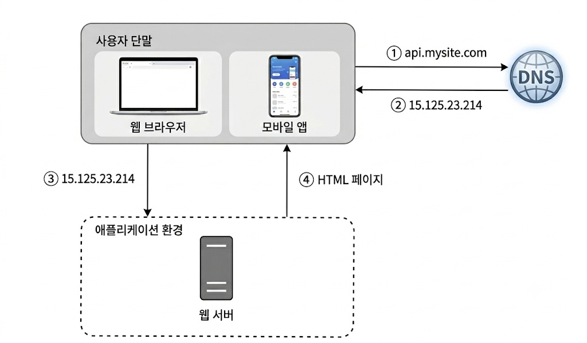

1. 사용자는 도메인의 이름을 이용해 DNS에 질의해 IP로 변환함
2. DNS 조회 결과로 IP 주소를 반환받음
3. 해당 IP주소로 HTTP Call
4. 요청 받은 웹 서버는 HTML or Json 형태의 응답 반환

## 데이터베이스
사용자가 늘면 서버 하나로는 충분하지 않아 여러 서버를 두어야한다.  
하나는 웹/모바일 트래픽 처리, 다른 하나는 DB용이다.  
웹 계층과 데이터베이스 서버를 분리하면 그 각각을 독립적으로 확장해 나갈 수 있게 된다.

**RDB**: 자료를 테이블과 행, 열 칼럼으로 표기, 관계에 따라 조인함  
**NoSQL**: 일반적으로 Join 연산을 지원하지 않으며, 비정형 데이터, 낮은 응답시간, 아주 많은 데이터를 저장시 사용한다.

NoSQL 예시  

| 이름 | 설명 | 장단점 |
|---|---|---|
| Key-Value Store | Key를 이용해 Value에 접근하는 데이터 저장 방식 |데이터 처리속도 빠름, 조건 검색 및 특정 값 고르기 어려움|
| Graph Store | 노드 사이 관계 엣지 연결, 관계가 복잡한 데이터에 사용 | SNS 친구관계, 추천 망 등에 유용, 통계에 불리|
| Column Store | 데이터를 열단위로 묶어 저장 | 통계, 로그에 유리(초고속 처리) 한줄씩 수정시 느림|
| Document Store | json을 통으로 모든 정보 저장 (블로그, 카탈로그 데이터 한번에 처리) | json 형태이기 때문에 개발 직관, 유연함, 데이터 중복성의 우려와 관리가 복잡하다는 단점 존재|

## 수직적 VS 수평적 확장
### 수직적 확장 (Scale UP)
서버에 고사양 자원(더 좋은 CPU, RAM 추가)하여 성능 개선하는 행위  
장애에 대한 자동 복구나 다중화 방안을 제시하지 않아 대규모 애플리케이션에 어려움

### 수평적 확장 (Scale OUT)
더 많은 서버를 추가하여 성능을 개선하는 행위, 대규모에 유리

### 로드밸런서 (LB)

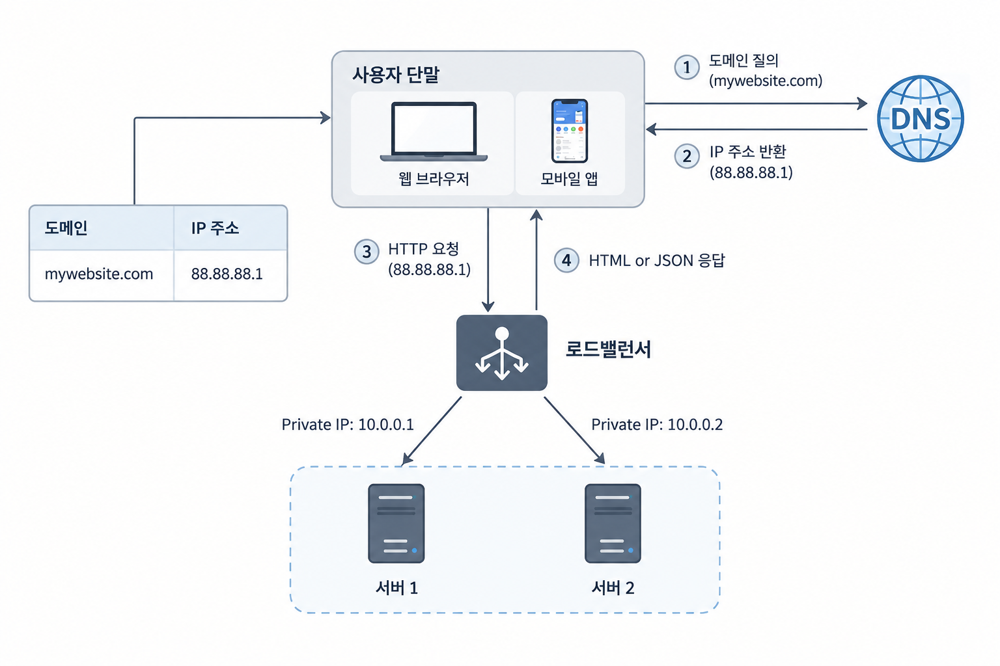

load balancing set에 속한 웹 서버들에게 트래픽 부하를 고르게 분산하는 역할  
사용자는 로드밸런서의 공개 IP 주소로 접속하게 되며 웹 서버는 클라이언트의 접속을 직접 처리하진 않는다.  
no failover가 자연스럽게 해소되어 가용성이 향상된다
- 서버 1이 다운되면 모든 트래픽은 서버 2로 전송된다. (no failover 해소)
- 웹사이트로 유입되는 트래픽이 가파르게 증가하면 서버를 증설하여 로드밸런싱 처리를 하여 우아하게 대응 가능하다.

### 데이터베이스 다중화

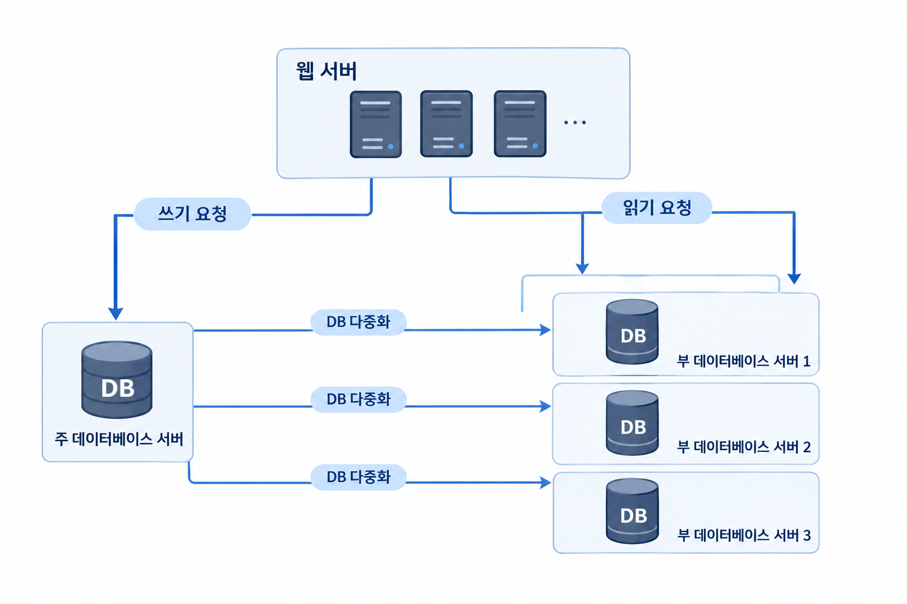

#### 특징
서버 사이에 master-slave 관계를 설정하고 데이터 원본은 주 서버에 사본은 부 서버에 저장  
쓰기 연산은 master에서만 지원, 부 데이터베이스는 주 데이터베이스로부터 사본을 전달 받으며, 읽기 연산만을 지원함  
데이터베이스를 변경하는 insert,delete update 등의 명령은 주 데이터베이스로만 전달되어야 한다.  
대부분 Application은 읽기 > 쓰기 이기 때문에 통상 부 데이터베이스의 수가 더 많다.  
주 데이터베이스 서버가 다운되면 다른 부 데이터서버가 주 데이터서버가 될것이다. 

#### 장점
**더 나은 성능**: 모든 DB 변경 연산은 주 데이터베이스 서버로 읽기 연산은 부 데이터베이스 서버로 분산되어 지므로 병렬 처리될수있는 query가 늘어나 성능이 좋아진다. 

**안정성 (reliability)**: 모종의 이유로 데이터베이스 서버 일부가 파괴되어도 데이터는 지역적으로 떨어진 여러 장소에 다중화 되어 저장되므로 보존된다.

**가용성 (availability)**: 데이터를 여러 지역에 복제해 둠으로써 하나의 데이터 서버에 장애가 발생하더라도 다른 서버에 있는 데이터를 가져와 계속 서비스할 수 있게 된다.

#### 추가사항
**다중 마스터**  
여러 노드가 모두 쓰기를 받을 수 있고, 각자의 변경 사항을 서로에게 복제  

장점  
- 한 노드가 죽어도 다른 노드에서 바로 쓰기가 가능해 가용성이 높음
- 지역별로 가까운 노드에 쓰기 분산이 가능함

핵심문제
- 두 노드에서 같은 행을 동시에 수정 할 시 충돌이 생김 따라서 아래와 같이 처리함
    - 마지막 쓰기 우선
    - 인증 기반으로 충돌 트랜잭션 롤백
    - 애플리케이션 레벨에서 해결 규칙 정의

**원형 다중화**   
노드들을 고리형태로 연결하는 복제 토폴로지 A -> B -> C -> A   
각 노드는 앞 노드에서 변경을 받아 적용하고 다시 다음 노드로 넘김  
모든 노드가 쓰기를 받으면 결과적으로 다중 마스터 처럼 동작  

단점  
- 한 노드만 죽어도 링이 끊겨 그 뒤 노드들이 변경을 받지 못해 수동으로 링 재구성이 필요함
- 노드를 거칠수록 복제 지연 누적됨
- 자체적 충돌 해결 기능이 없음  

보통은 그래서 Group Replication(MySQL), Galera(MariaDB, Percona) 같은 방식을 사용함
두 방식의 근본 원리는 비슷함
1. 트랜잭션은 접속한 노드에서 로컬로 실행
2. COMMIT 시점에 변경 내용(writeset)을 과반수 합의를 통해 모든 노드에 같은 순서로 전파
3. 각 노드가 독립적으로 충돌 여부를 검사(certification), 같은 순서로 받으므로 모두 같은 결론
4. 충돌 시 나중 순서의 트랜잭션을 롤백, 없으면 모든 노드에 반영

과반수 합의가 필요하므로 최소 3대로 구성
전파·검사는 동기, 반영은 비동기라 커밋당 네트워크 왕복 1회만큼 지연 발생
→ 같은 데이터센터에서는 미미하지만, 리전 간 구성에서는 부담이 큼

## 캐시
캐시는 값 비싼 연산 결과 또는 자주 참조되는 데이터를 메모리 안에 두고, 뒤 이은 요청이 보다 빨리 처리될 수 있게하는 저장소이다.  
데이터베이스를 얼마나 자주 호출하느냐가 애플리케이션의 성능을 좌우하는데 캐시는 그런 문제를 완화 할 수있다.

### 캐시계층
캐시 계층은 데이터가 잠시 보관되는 곳으로 데이터베이스보다 훨씬 빠르다.  
별도의 캐시 계층을 두면 데이터베이스의 부하를 줄이고 성능을 개선할 수 있다.

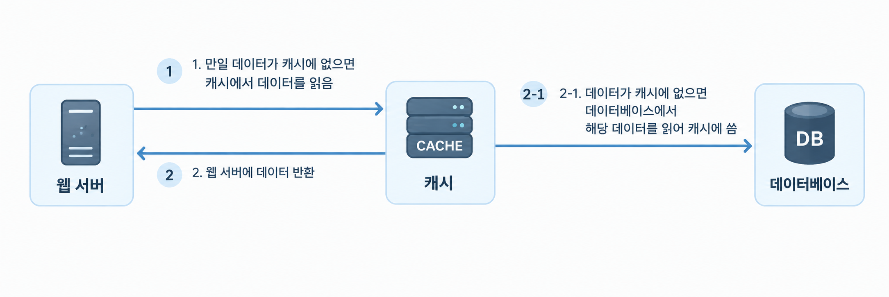

요청을 받은 웹서버는 캐시에 응답이 저장 되어있는 지를 보고 저장되어있다면 클라이언트에게 반환,  
없으면 데이터베이스 질의를 통해 데이터를 찾아 캐시에 저장하고 클라이언트에게 반환한다. (읽기 주도형 캐시 전략)

### 캐시 전략

캐시할 데이터 종류, 크기, 액세스 패턴에 맞춰 선택하며, 실무에서는 읽기 전략과 쓰기 전략을 조합해서 사용함

#### 읽기 전략

| 전략 | 동작 | 장점 | 단점 |
|---|---|---|---|
| **Cache-Aside** (Lazy Loading) | 애플리케이션이 캐시 확인 → 없으면 DB 조회 후 캐시에 저장 | 구현이 단순함, 필요한 데이터만 캐시됨 | 첫 요청은 항상 캐시 미스 |
| **Read-Through** | 애플리케이션은 캐시에만 요청 → 없으면 캐시가 직접 DB 조회 후 저장 | 애플리케이션 코드가 단순해짐 | 캐시 라이브러리/서버가 DB 로딩 기능을 지원해야 함 |
| **Refresh-Ahead** | 만료가 가까운 데이터를 미리 갱신 | 자주 읽히는 데이터의 캐시 미스 감소 | 안 읽힐 데이터까지 갱신하면 자원 낭비 |

#### 쓰기 전략

| 전략 | 동작 | 장점 | 단점 |
|---|---|---|---|
| **Write-Through** | 캐시와 DB에 동시에 씀 | 캐시와 DB가 항상 일치 | 쓰기 속도가 느림 |
| **Write-Around** | DB에만 쓰고 캐시는 건너뜀 | 안 읽힐 데이터로 캐시가 오염되지 않음 | 쓴 직후 읽으면 캐시 미스 |
| **Write-Back** (Write-Behind) | 캐시에만 쓰고 DB에는 나중에 일괄 반영 | 쓰기가 매우 빠름 | 캐시 장애 시 데이터 유실 위험 |

#### 흔한 조합

- **Cache-Aside + Write-Around**: 가장 일반적, 쓰기 시 DB 갱신 후 해당 캐시 삭제(invalidate)
- **Read-Through + Write-Through**: 일관성이 중요한 경우
- **Write-Back**: 조회수, 좋아요 수처럼 쓰기가 잦고 약간의 유실이 허용되는 데이터

### 캐시 사용시 유의할 점
- 캐시는 어떤 상황에 바람직한가  
데이터 갱신은 자주 일어나지 않지만 참조는 빈번하게 일어난다면 고려

- 어떤 데이터를 캐시에 두어야하는가  
캐시는 데이터를 휘발성 메모리에 두므로 영속적으로 보관할 데이터를 캐시에 두는것은 바람직하지 않다. 중요 데이터는 영속적 데이터 장소에 둬야한다.  

- 캐시에 보관된 데이터는 어떻게 만료(expire) 되는가  
만료 데이터가 캐시에서 삭제되어야 하므로 이에 대한 정책을 만들어 둬야한다.  

- 일관성(consistency)는 어떻게 유지되는가  
데이터저장소의 원본과 캐시 내의 사본이 같은지 여부로 저장소의 원본을 갱신하는 연산과 캐시를 갱신하는 연산이 단일 트랜잭션으로 처리되지 않는 경우 일관성이 깨질 수있기 때문에 주의한다.

- 장애에는 어떻게 대처할 것인가  
캐시 서버를 한대만 두는 경우 해당 서버는 단일 장애 지점(Single Point of Failure, SPOF)가 되어버릴 가능성이 있으므로 여러 지역에 걸쳐 캐시 서버를 분산해야한다.  

- 캐시 메모리는 얼마나 크게 잡을 것인가  
캐시 메모리가 너무 작으면 액세스 패턴에 따라서는 데이터가 너무 자주 캐시에서 밀려나버려 캐시의 성능이 떨어지게 된다.  
이를 막을 한가지 방법은 캐시 메모리를 과할당 하는 것이다.

- 데이터 방출 정책은 무엇인가  
캐시가 꽉 차버리면 추가로 캐시에 데이터를 넣어야할 경우 기존 데이터를 내보내야한다.  
이를 캐시 데이터 방출 정책이라 하는데 보통은 LRU(마지막 사용시점 가장 오래된 데이터)를 사용한다.  
다른 정책으로는 LFU(사용된 빈도가 가장 낮은 데이터를 내보내는), FIFO(가장 먼저 캐시에 들어온 데이터) 등이 있다.

## 콘텐츠 전송 네트워크 (CDN)
CDN은 정적 콘텐츠를 전송하는 데 쓰이는, 지리적으로 분산된 서버의 네트워크이다.  
이미지, 비디오, CSS, JavaScript 파일 등을 캐시할 수 있다.

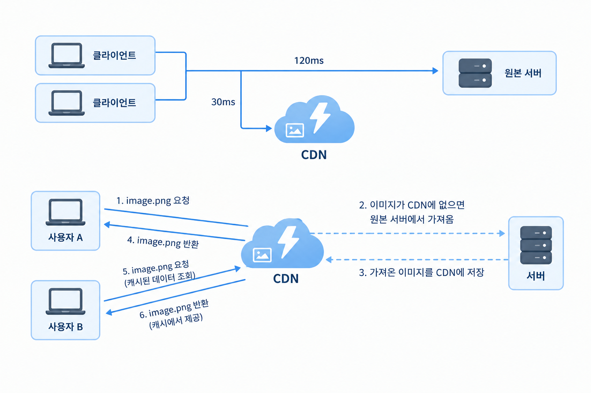
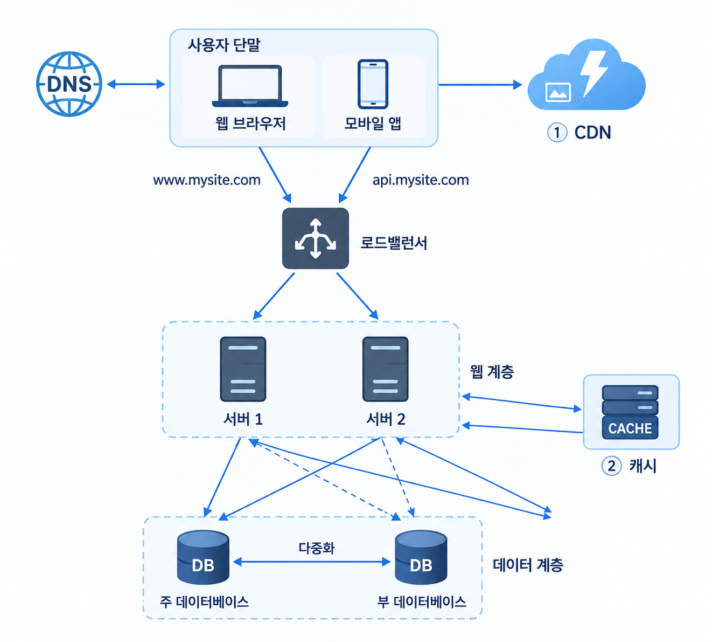

### 동작과정
1. 사용자 A가 이미지 URL을 이용해 image.png에 접근한다.  
접근하는 URL의 도메인은 CDN 서비스 사업자가 제공한 것이다.
2. CDN 서버의 캐시에 해당 이미지가 없는 경우, 서버는 원본 서버에 요청하여 파일을 가져온다.  
3. 원본 서버가 파일을 CDN 서버에 반환한다.  
응답의 HTTP 헤더에는 해당 파일이 얼마나 오래 캐시 되어질 수 있는지 TTL(Time-To-Live) 값이 들어있다.
4. CDN 서버는 파일을 캐시하고 사용자 A에게 반환한다. 이미지는 TTL에 명시된 시간이 끝날 때까지 캐시된다.
5. 사용자 B가 같은 이미지에 대한 요청을 CDN에게 전송한다.
6. 만료되지 않은 이미지에 대한 요청은 캐시를 통해 처리된다.

### CDN 사용시 고려해야할 사항
- 비용: CDN은 보통 thirdparty provider에 의해 제공되면서 CDN in/out에 따른 요금을 고려해야한다.  
- 적절한 만료 시한 설정: 시의성(time-sensitive) 콘텐츠의 경우 만료 시점을 잘 정해야한다.
- CDN 장에에 대한 대처 방안: CDN 자체가 죽었을 경우 애플리케이션 동작을 고려해야한다.  
- 콘텐츠 무효화 방법: 아직 만료되지 않은 컨텐츠라하도 CDN에서 제거하는 전략이 고려되어져야한다.  
다음과 같은 방법이 존재한다.
    - CDN 서비스 사업자가 제공하는 API 사용
    - 콘텐츠의 다른 버전을 서비스하도록 오브젝트 버저닝 이용

## 무상태(Stateless) 웹 계층
상태 정보를 웹 계층에서 제거하고 관계형 데이터베이스나, NoSQL 같은 지속성 저장소에 보관하고, 필요할 때 가져오도록 구성한 웹 계층

### 무상태 아키텍처

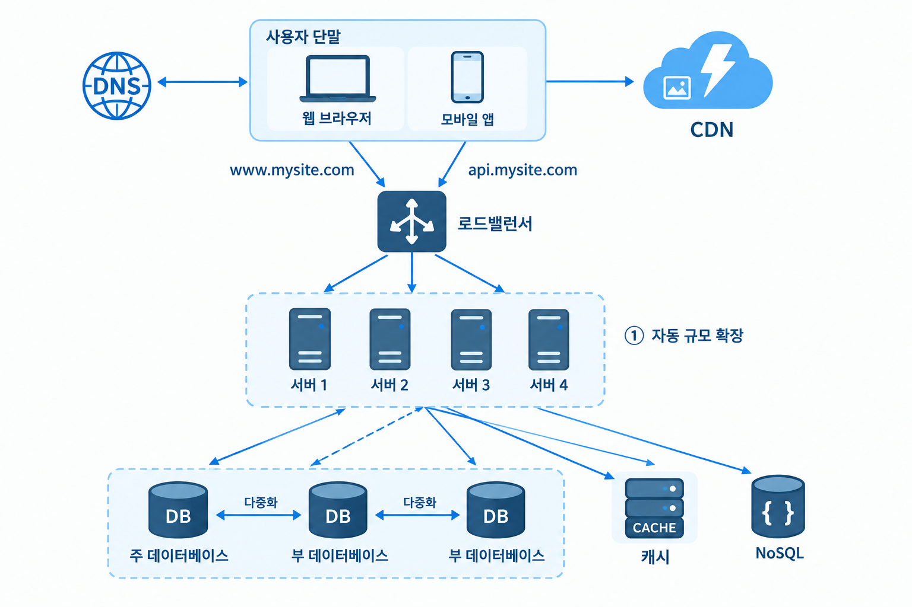

## 데이터 센터  
아래 그림은 두개의 데이터 센터를 이용하는 사례이다  
장애가 없는 상황에서는 사용자는 가장 가까운 데이터 센터로 안내되는데 이를 지리적 라우팅이라 부른다.  
geoDNS(지리적라우팅)은 사용자 위치에 따라 도메인 이름을 어떤 IP 주소로 변환할지 결정할 수 있도록 해주는 DNS 서비스이다.

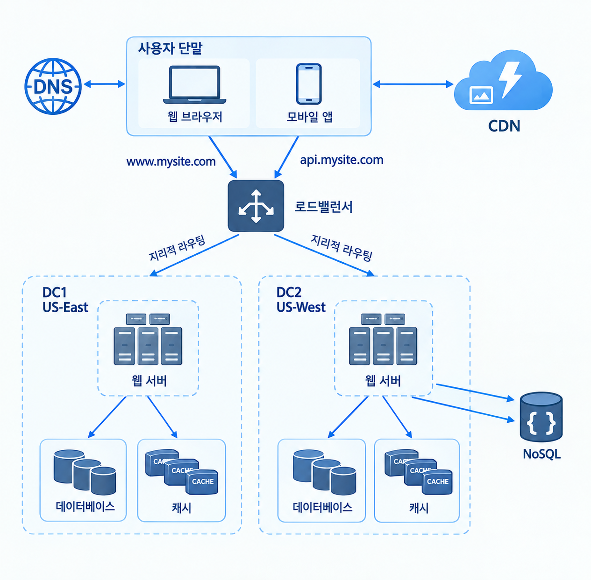

위 그림에서 만일 특정 데이터 센터에 심각한 장애가 발생하면 모든 트래픽은 장애가 없는 다른 데이터 센터로 전송된다.  
다중 데이터센터 아키텍처를 만들기 위해서는 몇가지 기술적 난제를 해결해야한다.
- **트래픽 우회**: 올바른 데이터 센터로 트래픽을 보내는 효과적 방법을 찾아야한다.
    - 예컨대 GeoDNS는 사용자에게서 가장 가까운 데이터센터로 트래픽을 보낼 수 있게 해준다.

- **데이터 동기화**: 데이터 센터마다 별도의 데이터베이스를 사용하고 있는 상황이라면, 장애가 자동으로 복구되어 트래픽이 다른 데이터베이스로 우회된다 해도, 해당 데이터센터에는 찾는 데이터가 없을 수 있다.  
이런 상황을 막는 보편적 전략은 데이터를 여러 데이터센터에 걸쳐 다중화하는 것이다.  

- **테스트와 배포(deployment)**: 여러 데이터 센터를 사용하도록 시스템이 구성된 상황이라면 웹 사이트 또는 애플리케이션을 여러 위치에서 테스트해보는 것이 중요하다.  한편, 자동화된 배포 도구는 모든 데이터 센터에 동일한 서비스가 설치되도록 하는데 중요한 역할을 한다.

### 넷플릭스는 어떻게?
> 출처: [Netflix TechBlog - Active-Active for Multi-Regional Resiliency (2013)](https://netflixtechblog.com/active-active-for-multi-regional-resiliency-c47719f6685b)

넷플릭스는 자체 데이터센터 대신 AWS의 여러 리전(버지니아 US-East-1, 오레곤 US-West-2)에 모든 서비스를 동일하게 배포하는 **Active-Active** 구조를 사용한다.  
평상시에는 가까운 리전으로 약 50:50 분산하고, 한 리전에 장애가 나면 전체 트래픽을 다른 리전으로 옮긴다.

**전제 조건**
- 서비스는 무상태(stateless)여야 하고, 상태 복제는 데이터 계층이 담당한다.
- 사용자 요청 경로에 리전 간 호출이 없어야 하며, 복제는 전부 비동기로 한다. (최종 일관성 허용) --> 리전 죽어도 대응 되도록 처리한 것

**트래픽 우회 → geoDNS + Route53 + Zuul**
- UltraDNS로 지역별 라우팅을 하고, 그 아래 Route53(AWS DNS) 계층에서 CNAME(도메인 별칭)만 바꿔 리전을 빠르게 전환한다.
- API 게이트웨이인 Zuul이 잘못된 리전으로 온 요청을 올바른 리전으로 넘기고, 트래픽 상한을 넘는 요청은 버려(load shedding) 뒤쪽 서비스를 보호한다.

**데이터 동기화 → Cassandra 비동기 복제 + 캐시 무효화**
- DB는 Cassandra(여러 노드에 데이터 나눠 저장하는 분산 NoSQL DB)의 멀티 리전 비동기 복제를 사용한다.  
(한 리전에 쓴 100만 건을 500ms 후 다른 리전에서 모두 읽어냄)
- 캐시(EVCache)는 복제하지 않고, 쓰기 발생 시 SQS 메시지로 다른 리전의 캐시 항목을 무효화한다.

**테스트와 배포 → 단계적 자동 배포 + 카오스 엔지니어링**
- 배포 도구(Mimir)로 리전별로 몇 시간 간격을 두고 순차 배포하며, 카나리 분석과 자동 롤백을 적용한다.
- 일부러 장애를 일으켜 검증한다.
    - Chaos Gorilla: 가용 영역(AZ) 하나를 통째로 중단
    - Split-brain: 리전 간 연결을 끊음
    - Chaos Kong: 리전 하나를 비우고 다른 리전이 전체 트래픽을 감당하는지 확인

**트레이드오프**
- 각 리전이 혼자서 전체 트래픽을 감당할 여유 용량을 항상 확보해야 하므로 비용이 크다.

## 메시지 큐
메시지 큐는 메시지의 무손실(메시지 큐에 보관된 메시지는 소비자가 꺼낼 때까지 안전히 보관된다는 특성)을  
보장하는 비동기 통신을 지원하는 컴포넌트이다.

### 아키텍처 및 특징

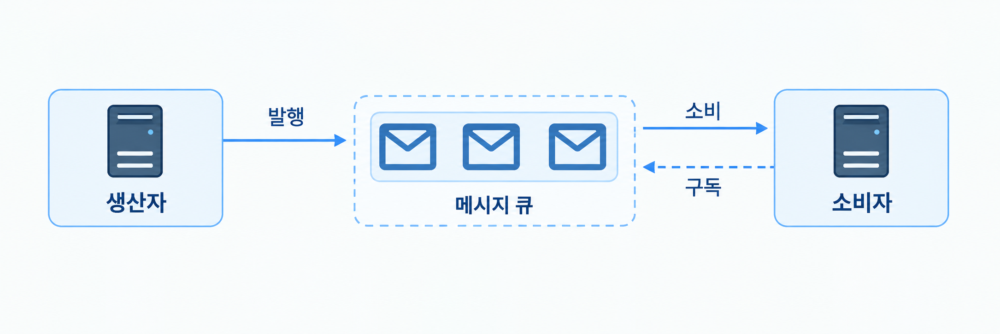

- **구성 요소**
    - **생산자(Producer)**: 메시지를 만들어 큐에 발행(publish)한다.
    - **메시지 큐(Message Queue)**: 메시지를 보관하는 버퍼 역할을 한다.
    - **소비자(Consumer)**: 큐에서 메시지를 꺼내(subscribe) 그에 맞는 동작을 수행한다.

- **특징: 느슨한 결합(Loose Coupling)**
    - 생산자와 소비자가 서로를 직접 호출하지 않고 큐를 통해서만 소통한다.
    - 덕분에 규모 확장성과 안정성이 중요한 애플리케이션을 구성하기에 좋다.

- **장애 격리**
    - 소비자가 다운되어 있어도 생산자는 메시지를 발행할 수 있다.
    - 생산자가 가용하지 않아도 소비자는 큐에 쌓인 메시지를 수신할 수 있다.

- **독립적인 확장**
    - 생산자와 소비자를 각각 따로 늘리거나 줄일 수 있다.
    - 예: 큐에 메시지가 많이 쌓이면 소비자(작업 서버)만 추가해 처리 속도를 높인다.

## 로그, 메트릭 그리고 자동화

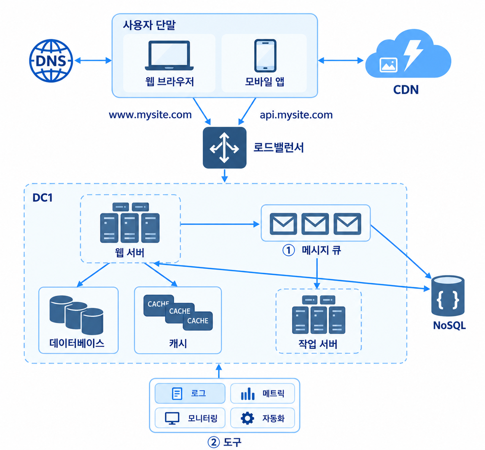

소규모 서비스에서는 있으면 좋은 정도지만, 사업 규모가 커지면 로그, 메트릭, 자동화는 반드시 투자해야 하는 영역이 된다.

### 로그
- 에러 로그를 모니터링하면 시스템의 오류와 문제를 빠르게 찾아낼 수 있다.
- 서버마다 따로 볼 수도 있지만, 로그를 한곳으로 모아주는 도구를 쓰면 검색과 조회가 훨씬 편리하다.

### 메트릭
- 잘 수집한 메트릭은 시스템 상태 파악은 물론 사업 현황 분석에도 쓰인다.
- **호스트 단위 메트릭**: CPU, 메모리, 디스크 I/O
- **종합(aggregated) 메트릭**: 데이터베이스 계층, 캐시 계층의 성능
- **핵심 비즈니스 메트릭**: 일별 능동 사용자(DAU), 수익(revenue), 재방문(retention)

### 자동화
- 시스템이 크고 복잡해질수록 생산성을 위해 자동화 도구가 필요하다.
- **지속적 통합(CI)**: 코드가 커밋될 때마다 자동 검증을 거쳐 문제를 조기에 발견한다.
- 빌드, 테스트, 배포 절차까지 자동화하면 개발 생산성이 크게 향상된다.

## 데이터베이스의 규모 확장
저장할 데이터가 많아지면 데이터베이스에 대한 부하도 증가한다.  
데이터베이스의 규모를 확장하는 방법에는 수직적 확장과 수평적 확장 두 가지가 있다.

### 수직적 확장 (Scale-up)
- 기존 서버에 더 많은, 또는 더 고성능의 자원(CPU, RAM, 디스크 등)을 증설하는 방법이다.
    - 예: AWS RDS는 24TB RAM 서버까지 제공하며, 스택오버플로는 2013년 천만 명의 사용자를 마스터 DB 한 대로 처리했다.
- **약점**
    - 하드웨어 한계: 무한 증설이 불가능해 사용자가 계속 늘면 결국 감당할 수 없다.
    - SPOF(Single Point of Failure, 단일 장애 지점)로 인한 위험이 크다.
    - 고성능 서버일수록 비용이 많이 든다.

### 수평적 확장 (Scale-out, 샤딩)
- 더 많은 서버를 추가해 성능을 향상시키는 방법으로, 샤딩(sharding)이라고도 부른다.
- 대규모 데이터베이스를 샤드(shard)라는 작은 단위로 분할한다.
- 모든 샤드는 같은 스키마를 쓰지만, 샤드 간 데이터 중복은 없다.

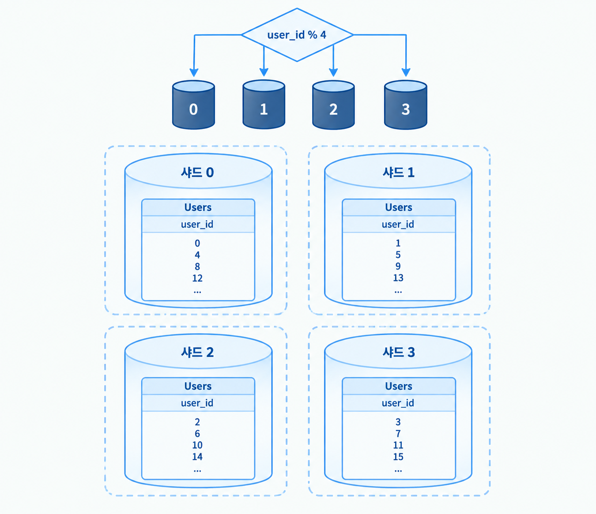

#### 샤딩 키 (Sharding Key)
- 데이터를 어느 샤드에 보낼지 정하는 하나 이상의 칼럼으로, 파티션 키(partition key)라고도 부른다.
    - 예: `user_id % 4`의 결과(0~3)에 따라 해당 번호의 샤드에 저장한다.
- 샤딩 키로 올바른 샤드에 바로 질의할 수 있어 효율이 높아진다.
- **데이터를 고르게 분산시킬 수 있는 키를 고르는 것이 가장 중요하다.**

#### 샤딩의 문제점
- **재 샤딩(Resharding)**
    - 필요한 경우: 데이터가 너무 많아 한 샤드로 감당하기 어려울 때, 또는 분포가 고르지 않아 특정 샤드만 빨리 차는 샤드 소진(shard exhaustion)이 발생할 때
    - 샤드 키 계산 함수를 바꾸고 데이터를 재배치해야 한다.
    - 해결책: 안정 해시(consistent hashing) 기법 (5장)
- **유명인사(Celebrity) 문제 = 핫스팟 키(Hotspot Key) 문제**
    - 특정 샤드에 질의가 집중되어 과부하가 걸리는 문제다.
    - 예: 유명인 계정들이 한 샤드에 몰리면 해당 샤드에 read 부하가 집중된다.
    - 해결책: 유명인마다 샤드를 따로 할당하거나 더 잘게 쪼갠다.
- **조인과 비정규화 (Join & De-normalization)**
    - 여러 샤드에 걸친 데이터는 조인하기 어렵다.
    - 해결책: 비정규화로 하나의 테이블에서 질의가 끝나도록 한다.

### 참고: NoSQL은 실제로 어디에 쓰이나?
> 출처: [What The Heck Are You Actually Using NoSQL For? (High Scalability, 2010)](https://highscalability.com/what-the-heck-are-you-actually-using-nosql-for/)

아래는 인터넷에 흩어진 NoSQL 실사용 사례를 모아 정리한 글이다.

#### 1. NoSQL을 쓰는 일반적인 이유
- **대규모(Bigness)**: 데이터·사용자·서버가 너무 커서 대규모 분산이 필요할 때
- **대량 쓰기 성능**: 데이터가 한 노드에 안 들어가 쓰기를 클러스터에 분산해야 할 때
    - 예: 트위터 하루 7TB, 페이스북 한 달 1,350억 건 메시지
- **빠른 키-값 접근**: 키 해싱으로 메모리에서 바로 읽어 지연시간이 매우 짧다.
- **유연한 스키마·데이터 타입**: 문서, 칼럼, 그래프, 키-값 등 다양한 모델과 JSON 지원
- **스키마 변경 용이**: 스키마가 없어 마이그레이션 부담이 적다.
- **쓰기 가용성**: 어떤 상황에서도 쓰기가 성공해야 할 때 (→ CAP, 최종 일관성)
- **단일 장애 지점 제거**: 자동 로드밸런싱과 클러스터 확장으로 고가용성 구성
- **분산 시스템 지원**: 여러 데이터센터에 걸쳐 장애에 강하게 동작
- **CAP 트레이드오프 조절**: 일관성과 가용성 중 무엇을 우선할지 선택할 수 있다.
    - 관계형 DB는 강한 일관성을 택하므로 네트워크 분할에 취약하다.
- **그 외**: 운영 편의성, 병렬 처리(MapReduce) 내장, 개발자 친화성, 문제에 맞는 데이터 모델 선택

#### 2. 구체적인 활용 사례
- 로그·클릭스트림 같은 대량의 비트랜잭션 데이터 저장
- 캐시, 세션, 사용자 프로필 데이터
- 실시간 조회수 카운터, 투표, 리더보드
- 게임처럼 지연시간이 중요한 준실시간 시스템
- 복잡한 조인이 너무 무거워진 경우의 대체
- 트위터식 타임라인, 대량 데이터 분석(MapReduce, Hive)

#### 3. 제품별 사례
- **Redis**: 데이터 구조 서버
    - 리더보드(정렬 집합), 분산 락, API 요청 제한(rate limiting), 세션·CSRF 토큰 같은 임시 데이터
    - 샤드 위치 조회 서비스 (예: GitHub이 저장소 샤딩 관리에 사용)
    - Pub/Sub으로 대규모 실시간 브로드캐스트
- **VoltDB**: 관계형이지만 설계 철학이 NoSQL에 가까움
    - 금융 거래 모니터링, 광고 서빙, 항공 예약 등 파티션 키 기반의 고빈도 처리
- **Hadoop (분석)**: 트위터의 일별 요청 수, 지연시간 분포, 사용자 코호트 분석 등

#### 4. NoSQL이 적합하지 않은 경우
- **OLTP(Online Transaction Processing)**: 여러 객체에 걸친 복잡한 트랜잭션은 대체로 미지원
- **데이터 무결성**: 무결성을 애플리케이션이 책임져야 한다. 관계형 DB가 우세
- **데이터 독립성**: 데이터는 애플리케이션보다 오래 살아남는데, NoSQL은 애플리케이션에 종속적
- **SQL이 필요할 때**: SQL 인터페이스를 제공하는 제품이 적다.
- **Ad-hoc 쿼리**: 미리 정해 두지 않은 질문을 즉석에서 만들어 조회하는 쿼리. 
    - NoSQL은 조회 패턴을 미리 정해 설계하므로 약하다.
- **복잡한 관계**: 관계 표현은 여전히 관계형 DB가 강하다.
- **성숙도·안정성**: 관계형 DB가 도구·인력·신뢰도 면에서 앞선다.

**핵심**: NoSQL은 만능이 아니라, 규모·쓰기량·가용성이 중요할 때 고르는 선택지다.  
복잡한 트랜잭션·무결성·관계가 중요하면 여전히 관계형 DB가 낫다.